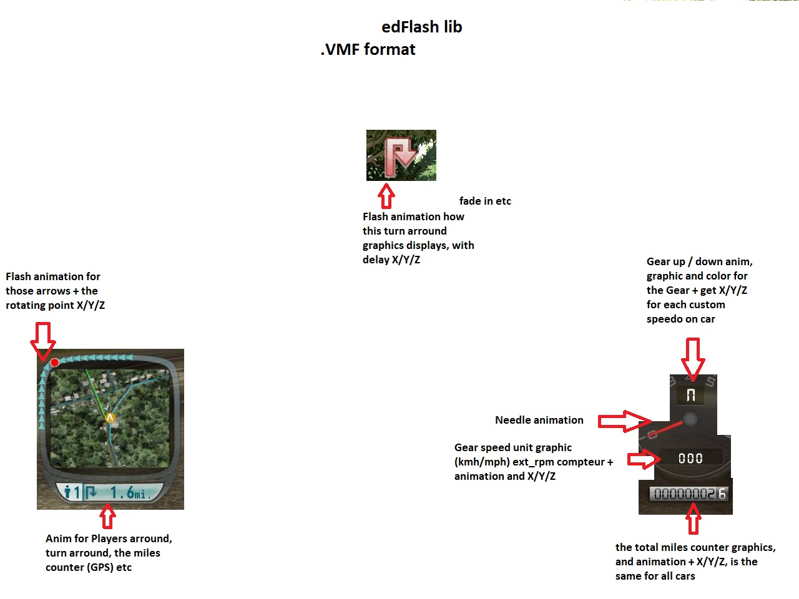
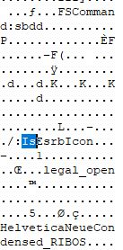

VMF FORMAT SPECIFICATION
========================

.VMF file - nicknamed "Virtual movie flash" , official its called the edFlash lib , the "eden games flash player" , edFlash animation.

Target platforms: PC, X360, PS2.

## Credits

Thanks to *resr rore* for the valuable information.

## Misc. notes

- .VMF is a flash animation protocoll by eden games, like a flash player that stores graphics and animations for menu

- is found inside every frontend bnk (hud.bnk, etc)

- stores information about X/Y/Z position and animation of menu layers (m_xxx) and how much of specific one (Nb_xxx), animation of speedo needle (aiguille), gear graphics and upshift / downshift anim, graphic for the total miles counter + anim for that

- is bound to the .2db files inside the bnk because its written for those .2db's.

## Usage examples

### ESRB edit

An example of log_in.bnk VMF, it stores couple of "Is" commands in this case the esrb icon on boot, here default is 0, when changed to 1 it enables the esrb logo on boot ! and other FScommands, Nb (number of) commands etc over all VMFs

